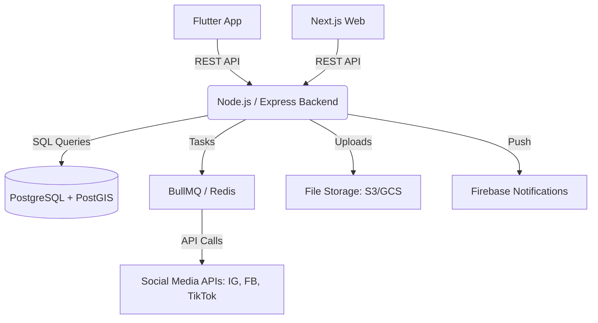

# Technology Stack & Architecture

This document outlines the technical architecture for **Where-Is-My-Slot**, a unified platform for location-based business offers.

## 1. Core Stack
| Layer | Technology | Rationale |
| :--- | :--- | :--- |
| **Mobile App** | **Flutter** | Cross-platform (iOS/Android) with a single codebase. High performance for UI-heavy social feeds. |
| **Web Frontend** | **Next.js** | Excellent SEO (critical for business discovery), server-side rendering (SSR), and fast page loads. |
| **Unified Backend**| **Node.js (Express)** | Scalable, asynchronous, and high-performance. Perfect for handling both Web and Mobile requests via a RESTful API. |
| **Primary Database**| **PostgreSQL** | Industry standard for relational data and high integrity. |
| **Spatial Engine** | **PostGIS** | Extension for PostgreSQL to handle all "City-Based" and "Nearby" logic efficiently. |

---

## 2. Infrastructure & Services (What’s Missing)

To build a production-ready social platform, you will also need the following components:

### A. Media Storage (Images & Videos)
*   **Recommendation:** **AWS S3** or **Google Cloud Storage**.
*   **Why:** You cannot store social media images/videos in the database. You need a dedicated object store and a **CDN (CloudFront/Cloudflare)** to serve them fast globally.

### B. Authentication & User Management
*   **Recommendation:** **Firebase Auth** or **Supabase Auth**.
*   **Why:** You need a unified identity provider that works seamlessly across Flutter (Mobile) and Next.js (Web). This handles phone OTP, Google Login, and Email/Password out of the box.

### C. Background Job Processing (The "Auto-Share" Engine)
*   **Recommendation:** **BullMQ** with **Redis**.
*   **Why:** Sharing a post to Instagram/TikTok/Facebook is a "heavy" task that can fail or take time. You should not make the user wait. The backend should push the task to a queue (BullMQ) and process it in the background.

### D. Real-time & Push Notifications
*   **Recommendation:** **Firebase Cloud Messaging (FCM)**.
*   **Why:** Crucial for alerting users about "Hot Offers" nearby or notifying businesses about engagement on their posts.

### E. API Documentation
*   **Recommendation:** **Swagger (OpenAPI)**.
*   **Why:** Since you have two different frontends (Flutter and Next.js) consuming the same backend, having a live, interactive API documentation is essential for development speed.

---

## 3. High-Level Architecture Diagram

## 4. Key Engineering Considerations
1.  **JWT Authentication:** Use JSON Web Tokens to keep the session state between the app/web and the backend.
2.  **Rate Limiting:** Protect your Express backend from abuse, especially on the "Offer Posting" endpoints.
3.  **Caching:** Use Redis to cache the "Trending Offers" in a city to avoid hitting the database on every page scroll.
